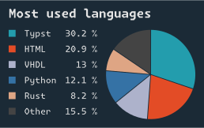

<a href="https://github.com/sermuns/skrytsam">
  
</a>

<div align="center">
  <p>
    <em>
        blazingly fast github profile stats for your README
    </em>
  </p>
  <a href="https://github.com/sermuns/skrytsam/releases/latest">
    </a>
  <a href="https://github.com/sermuns/skrytsam/blob/main/LICENSE">
    </a>
  <a href="https://crates.io/crates/skrytsam"></a>
</div>
<br>

> [!NOTE]
> work in progress, only [languages](#languages) card is implemented

`skrytsam` is a command-line tool that fetches GitHub profile statistics and generates SVG cards for use in your profile README.

## Cards

### `languages`



### `contributions`


## Installation

- from source:

  ```sh
  cargo install skrytsam
  ```

- from binaries, using [`cargo-binstall`](https://github.com/cargo-bins/cargo-binstall):

  ```sh
  cargo binstall skrytsam
  ```

- or download and extract the [latest release](https://github.com/sermuns/skrytsam/releases/latest)
